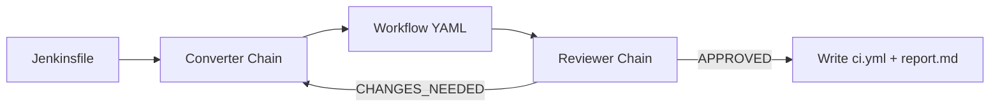
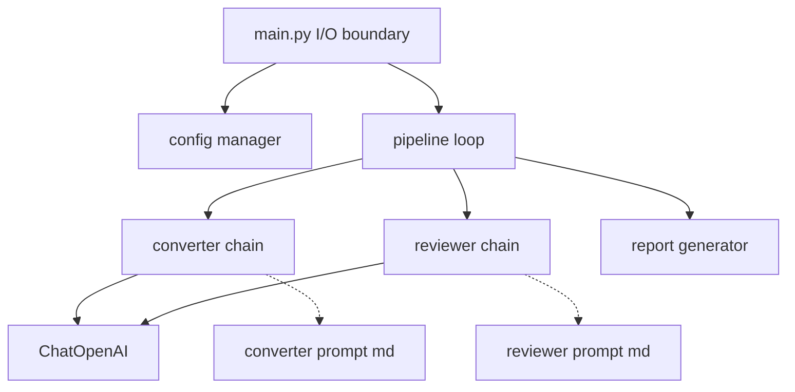

# AgenticConverter LC

LangChain-based CLI that converts Jenkinsfiles to GitHub Actions YAML using a converter-reviewer iterative loop.

## Overview

AgenticConverter LC keeps the same core pattern as the main `AgenticConverter` project:
- converter agent generates workflow YAML
- reviewer agent evaluates and returns `APPROVED` or `CHANGES_NEEDED`
- pipeline repeats until approval or `max_iterations`
- output includes `ci.yml` and `report.md`



## Quick Start

```bash
uv sync
uv run python -m src.main .data/input/1/Jenkinsfile
```

Convert all samples:

```bash
uv run python -m src.main .data/input/ -v
```

## CLI

```text
usage: agentic-converter-lc [-h] [-V] [-o DIR] [-n N] [-v] [path]
```

- `path` Jenkinsfile path or directory containing Jenkinsfiles
- `-V, --version` show app version from `pyproject.toml`
- `-o, --output-dir DIR` override output directory
- `-n, --max-iterations N` override max converter-reviewer iterations
- `-v, --verbose` print loop progress and reviewer feedback

## Configuration

Config precedence:
1. `config/config.json`
2. optional `config/config.local.json`
3. CLI flags (`-o`, `-n`, `-v`)

LangChain model connection is configured in `config/config.json` under `llm`.

## Data Layout

Two sample inputs are included:
- `.data/input/1/Jenkinsfile`
- `.data/input/2/Jenkinsfile`

Generated outputs:
- `.data/output/1/ci.yml`
- `.data/output/1/report.md`
- `.data/output/2/ci.yml`
- `.data/output/2/report.md`

## Report Generation

Each run produces `report.md` with:
- status, iteration count, confidence
- iteration history table
- manual verification checklist
- embedded generated YAML

Confidence rules:
- `HIGH`: approved in 1-2 iterations
- `MEDIUM`: approved in 3-4 iterations
- `LOW`: max iterations reached or error

## Architecture



- `src/main.py` CLI entrypoint and all file I/O
- `src/config/manager.py` typed config + merge
- `src/llm/client.py` `ChatOpenAI` factory
- `src/agents/converter.py` LangChain converter chain
- `src/agents/reviewer.py` LangChain reviewer chain
- `src/graph/pipeline.py` immutable state and orchestration
- `src/report/generator.py` markdown report generation
- `src/prompts/*.md` prompt-as-config

## Notes

- This repo intentionally follows the main project style, but replaces raw OpenAI SDK calls with LangChain chains.
- No automated test suite is currently included.
