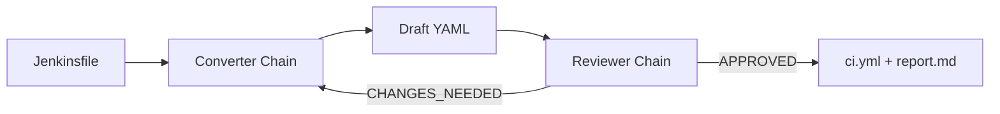
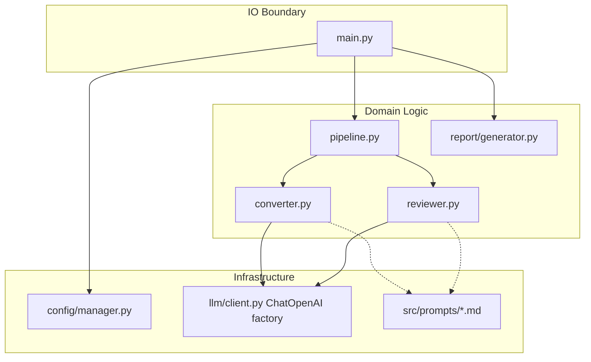

# AgenticConverter LC - Pitch

This document explains how the LangChain variant mirrors the main AgenticConverter approach while swapping the LLM integration layer to LangChain.

## 1. Goal

Build a local-first Jenkinsfile-to-GitHub-Actions converter that:
- uses a converter-reviewer feedback loop
- keeps clean architecture boundaries
- generates both `ci.yml` and `report.md`
- stays compatible with LM Studio OpenAI-style endpoints

## 2. High-Level Flow



## 3. System Architecture



## 4. LangChain-Specific Design

Compared with the main project:
- **same** pipeline state model and iterative orchestration pattern
- **same** prompt-as-config approach (`src/prompts/*.md`)
- **same** local endpoint assumptions and CLI behavior
- **different** LLM layer:
  - main project: raw OpenAI SDK wrapper
  - this project: LangChain `ChatOpenAI` + `ChatPromptTemplate` + `StrOutputParser`

### Why this matters

This proves we can keep architecture and behavior stable while swapping framework abstraction from SDK calls to chains.

## 5. Report Generation

Each output directory contains:
- `ci.yml`
- `report.md`

`report.md` includes:
- conversion status and iteration count
- confidence level (`HIGH`, `MEDIUM`, `LOW`)
- full iteration history table (convert/review steps)
- manual verification checklist
- embedded generated workflow YAML

## 6. Sample Data

The release includes two sample Jenkinsfiles:
- `.data/input/1/Jenkinsfile`
- `.data/input/2/Jenkinsfile`

Run both:

```bash
uv run python -m src.main .data/input/ -v
```

## 7. Operating Model

This project is intentionally:
- local-first
- minimal in dependencies
- easy to inspect/debug
- close in behavior and docs style to the main project

It is suitable as a side-by-side framework comparison baseline for LangChain adoption decisions.
